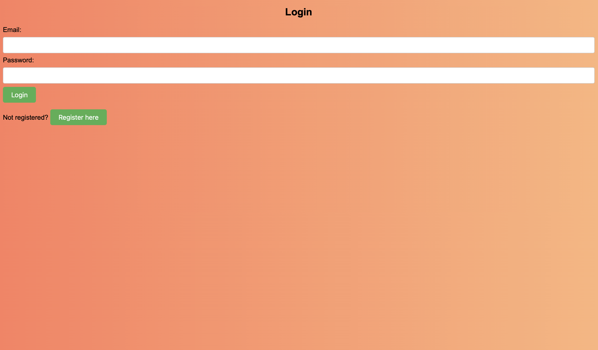
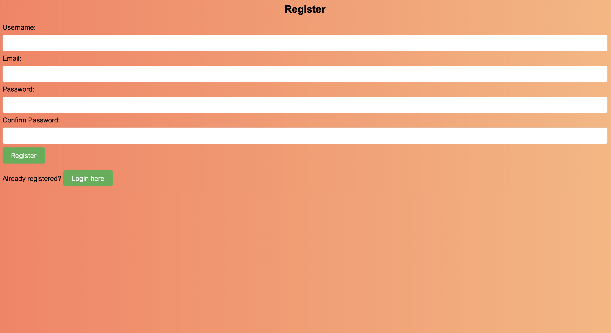
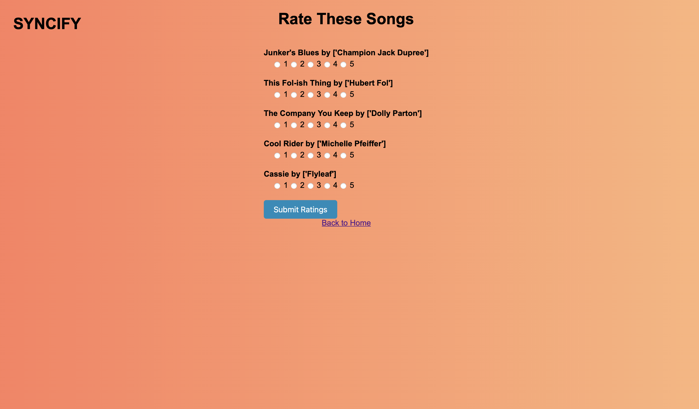
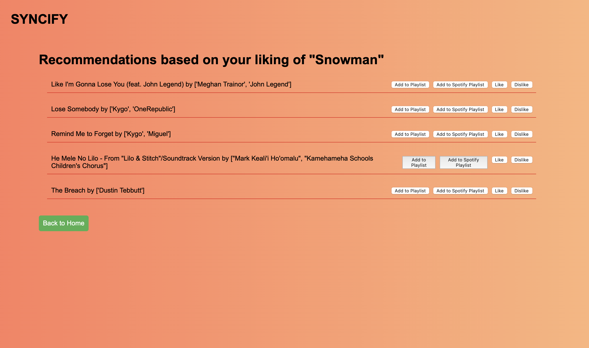
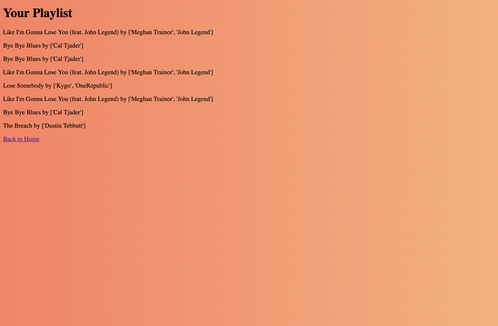

# Syncify

## Contributors:

* Syed Ali Haider
* Jasmeen kaur

## Overview

Discover your next favorite song with Syncify, your personal music recommendation companion! This web app harnesses the power of advanced recommendation algorithms to deliver personalized song suggestions that resonate with your unique taste. By connecting with Spotify's huge music library and using advanced data analysis, Syncify makes sure every song recommendation is spot on. You can rate songs, get personalized suggestions, and add songs directly to your Spotify playlists. With Syncify, you can explore new music and keep your playlists exciting. Say goodbye to boring music and hello to endless musical discoveries!

## Objective

* Utilize song features such as acousticness, danceability etc. to recommend similar songs based on content-based filtering techniques.
* Utilize song lyrics to recommend similar songs based on content-based filtering techniques.
* Enable dynamic recommendations by incorporating user data such as their ratings for the recommended songs
* Explore hybrid models combining content-based and collaborative filtering methods for enhanced recommendations.

## Dataset

* Spotify Dataset
    - spotify/train.csv
* MusixMatch Dataset
    - consine_similarity_svd.csv


## Data Model

The music recommendation system will store Users and their Ratings for the recommended songs. It also has potential extensions to include Liked Songs and User Playlists.

* Users can have multiple Ratings (via references).
* Each Rating is associated with a specific song index and a user (via references).
* Potentially, Songs can be part of multiple Playlists and each Playlist can belong to a User and contain multiple Songs (via references).

## Entity Relationships

* User to Ratings: One to Many; One user can have multiple ratings.
* Ratings to User: Many to One; Each rating is associated with one user.
* Ratings to Song Index: Many to One; Each rating corresponds to a specific song 

Potential Extension
* User to Playlists: One to Many; One user can have multiple playlists.
* Playlists to Songs: Many to Many; A playlist can have multiple songs, and a song can be part of multiple playlists.
* Songs to Playlists: Many to Many; A song can be part of multiple playlists, and a playlist can have multiple songs.


An Example User:

```python
{
  "username": "musicfan123",
  "email": "musicfan123@example.com",
  "password": "hashed_password",
  "ratings": [1, 2, 3]  # an array of references to Rating IDs
}
```

An Example Rating Document

```python
{
  "user_id": 1,  # a reference to a User ID
  "rating": 5,
  "song_index": 123,
  "date": "2024-05-17T12:34:56Z"
}
```

An Example Playlist Document

```python
{
    "playlist_id": 1,
    "user_id": 1,  # a reference to a User ID
    "songs": [1, 2, 3],  # an array of references to Song IDs
    "added_on": "2024-05-17T12:34:56Z"
}
```

An Example Song Document

```python
{
    "song_id": 1,
    "name": "Imagine",
    "artist": "John Lennon",
    "spotify_id": "spotify:track:12345"
}
```

## [Link to Schema Models](models.py) 


## Wireframes

/login - Page for User Login



/register - Page for User Registration



/home - Home Page


/rate_songs - Page for Rating Songs



/show_recommendations - Page for Showing Song Recommendations



/playlist - Page for Showing User Playlist



/search - Page for Searching Songs


## Site map

[Link to the Site Map](documentation/Syncify's-Site-Map.png) 


## Use Cases

1. As a non-registered user, I can register a new account with the site so that I can personalize my experience.
2. As a registered user, I can log in to the site to access my saved preferences and recommendations.
3. As a user, I can rate songs to provide feedback and improve my personalized recommendations.
4. As a user, I can view a list of song recommendations based on my ratings and preferences.
5. As a user, I can add recommended songs to my personal playlist for easy access.
6. As a user, I can search for specific songs or artists to receive tailored recommendations.
7. As a user, I can log in to my Spotify account to integrate my Spotify playlists with the recommendation system.
8. As a user, I can add recommended songs directly to my Spotify playlists for seamless music management.

## App Directory Flow

Syncify
├── main.py (recommendation system1)
├── lyrics_Added.py (recommendation system2)
└── spotify data (data1)
    ├── train.csv
└── musixMatch data (data2)
    ├── cosine_similarity_svd.csv 
├── ReadMe
├── IEEE Report
├── Appendix
└── app
    ├── __init__.py
    ├── auth.py
    ├── view.py
    ├── model.py
    └── template
        ├── login.html
        ├── home.html
        ├── search_page.html
        ├── rating.html
        ├── recommendation.html
        ├── playlist.html

## [Link to Initial Main Project File](app) 


## Instructions on how to run the application

1. Before running, make sure that all the required dependencies are installed on your computer, if not use the following command to install:
    * For Flask app
        pip install flask flask_login spotipy spotipy.oauth2 pandas numpy sqlalchemy os sklearn.metrics.pairwise werkzeug.security
    * For main.py
    * For lyrics_added.py
    
2. cd Syncify 
3. use ./run.py command to run your application (Make sure you are running the application within the Syncify folder)
4. open your web browser (google chrome not recommended as it blocks certain functionalities, safari preferred)
    use http://127.0.0.1:5000 to access the running application from your browser. 
    
## Instructions on how to run the recommendation systems only
 
